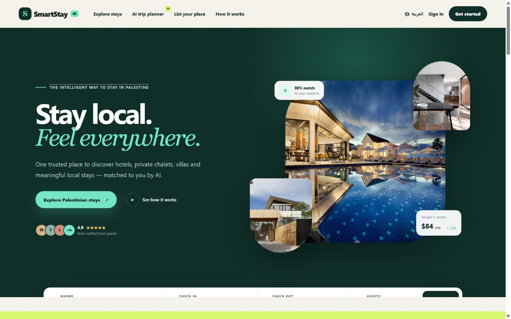
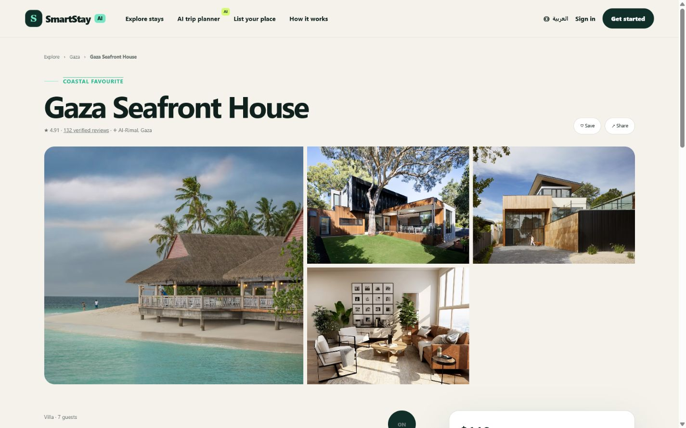
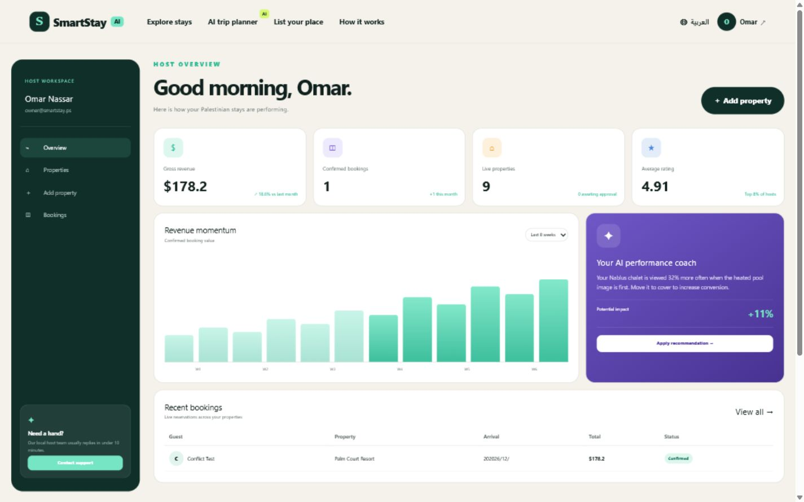
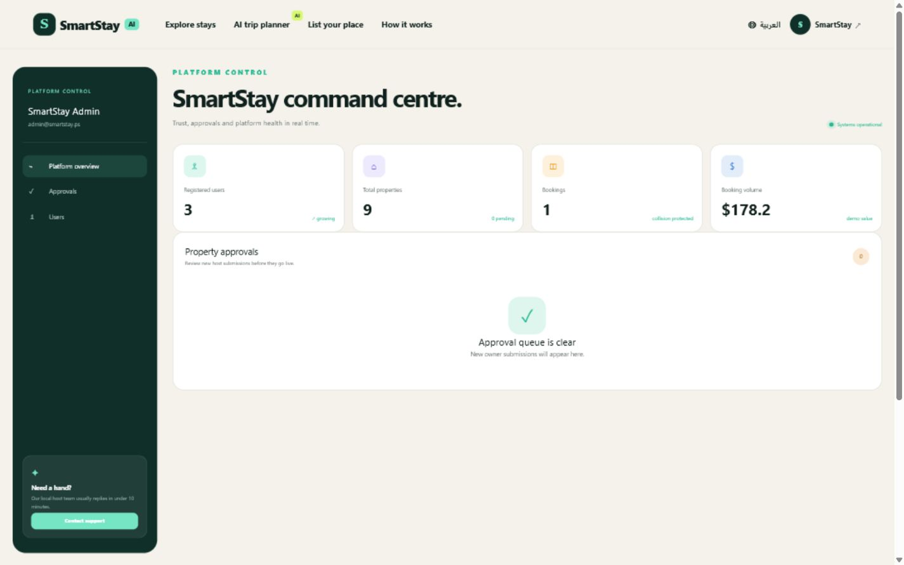
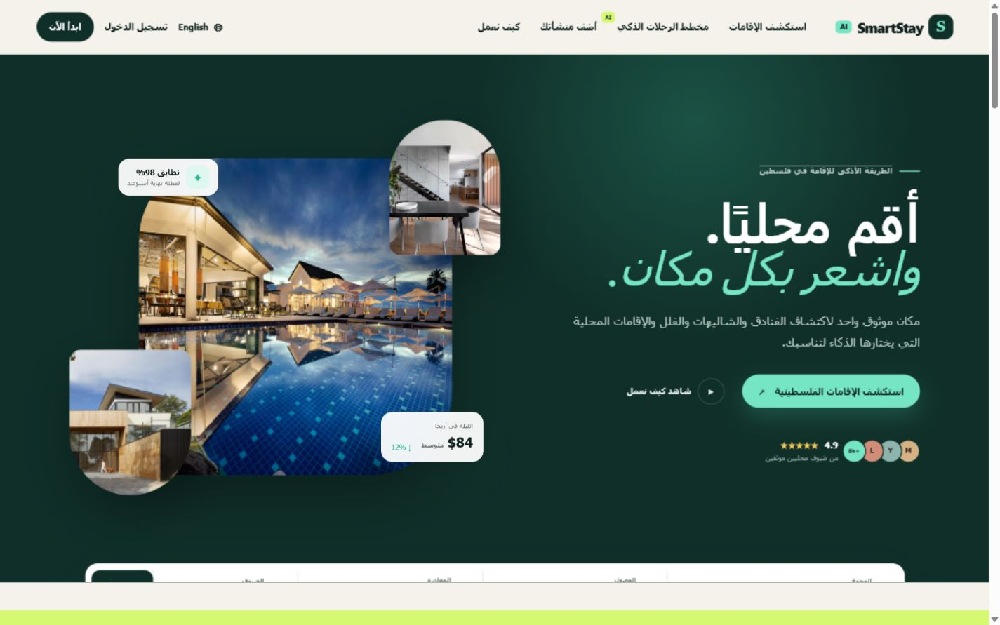
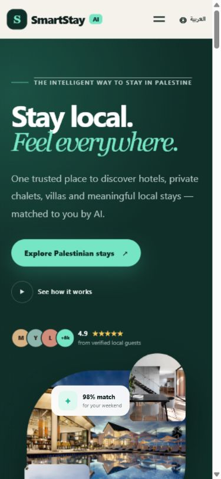

# SmartStay AI

Professional bilingual marketplace for hotels, chalets, villas, resorts and local stays across Palestine.

## Product showcase

### English experience



### Gaza property experience



### Property owner dashboard



### Admin dashboard



### Arabic and mobile support

| Arabic experience | Responsive mobile experience |
|---|---|
|  |  |

The complete **66-image** product walkthrough is available in [`docs/screenshots`](docs/screenshots/README.md), covering public pages, Gaza search and details, authentication, customer flows, property owner tools, administration, Arabic/RTL and mobile layouts.

## Product surfaces

- English-first responsive website with instant Arabic/RTL switching.
- Home, explore, AI planner, property details, host marketing and about pages.
- Customer registration, login, trip dashboard and saved stays.
- Owner registration, performance dashboard, properties, booking control and a four-step property creation wizard.
- Admin dashboard, property approval queue and user directory.
- Palestinian demo inventory in Gaza, Jericho, Bethlehem, Ramallah, Nablus, Hebron, Jenin, Tulkarm and Rawabi.

## Real backend

- Cloudflare D1 database with nine relational tables.
- PBKDF2 password hashing with a unique salt and 120,000 iterations.
- Server-side sessions stored as SHA-256 token hashes and delivered using HttpOnly cookies.
- Role-aware customer, owner and admin APIs.
- Cloudflare R2 image uploads for owner property galleries.
- Owner property workflow with pending/approved/rejected moderation states.
- Booking APIs, live availability and owner/customer booking dashboards.

## Double-booking protection

Every booking period is expanded into hourly inventory keys in `ss_booking_slots`.
The database has a unique index on `(property_id, slot_key)`. Even when two users submit at the same time, only one insert can succeed; the other receives HTTP `409 TIME_CONFLICT`.

## Free AI

No paid API key is required. The built-in local recommendation engine works immediately. If Ollama is available, `/api/ai` automatically uses the free local `qwen2.5:3b` model.

```powershell
ollama pull qwen2.5:3b
ollama serve
```

## Run on Windows

Double-click `RUN_SMARTSTAY.bat`, or run:

```powershell
npm install
npm run dev
```

Open `http://localhost:3000`.

## Demo accounts

| Role | Email | Password |
|---|---|---|
| Customer | `guest@smartstay.ps` | `Guest123!` |
| Owner | `owner@smartstay.ps` | `Owner123!` |
| Admin | `admin@smartstay.ps` | `Admin123!` |

## Validation

```powershell
npm test
```

The test suite builds the full application and checks bilingual pages, authentication security, owner uploads and database-level booking collision protection.

## Important production note

Payments are intentionally in demo mode. Enabling Stripe or PayPal requires the merchant's own account and production credentials. The rest of the core marketplace workflow is implemented and runnable locally.
